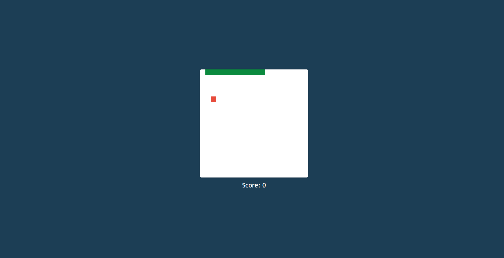

# Snake Game 🐍

A simple Snake game implemented using HTML, CSS, and JavaScript. Play the classic Snake game, control the snake with arrow keys, and eat the food to grow longer. Avoid hitting the walls or colliding with yourself!

📷 Screenshot:

## Features

💻 Responsive design with flat UI and Material UI styles.
⌨️ Keyboard controls to navigate the snake (Arrow keys).
🍎 Randomly generated food for the snake to eat.
🏆 Score display to keep track of the player's score.
❌ Game over message with a restart option.

## Technologies Used

🔧 HTML
🎨 CSS
💻 JavaScript

## Getting Started

To play the Snake game on your local machine, follow these steps:

1. Clone this repository to your local machine using `git clone` or download the ZIP file.
2. Navigate to the cloned or extracted directory.
3. Open the `index.html` file in your web browser.
4. Use the arrow keys to control the snake.
5. Eat the food and grow longer, but avoid hitting the walls or colliding with yourself.
6. When the game ends, click "OK" on the alert box to restart the game.

## Contributing

🤝 Contributions are welcome! If you would like to contribute to this Snake game project, please follow these steps:

1. Fork this repository.
2. Create a new branch with a descriptive name for your feature or bug fix.
3. Make your changes and commit them.
4. Push your changes to your forked repository.
5. Create a pull request to merge your changes into the main repository.

## License

📝 This project is licensed under the MIT License. See the [LICENSE](LICENSE.txt) file for more information.